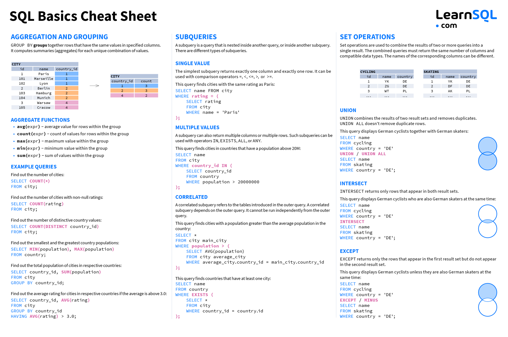

# Data Dive: immerse yourself in SQL and databases

An interactive workshop to introduce the fundamentals of SQL and databases.

## Requirements

You just need to have a computer with a Linux distribution installed. There is a list of recommended distributions below:

- [Ubuntu (version >= 18.04)](https://ubuntu.com/download/desktop)
- [Debian (version >= 10)](https://www.debian.org/distrib/)
- [Fedora (version >= 30)](https://getfedora.org/en/workstation/download/)

## Resources

1. [Presentation](data-dive-powerpoint.pdf)
2. [Installation of MySQL Server on Linux](1-installation/README.md)
3. [Database and Table Creation & Data Manipulation](2-creation_and_manipulation/README.md)
4. [Relationships between tables](3-relationships_and_exercises/README.md)

## Cheat Sheets

#### Basics Cheatsheet

#### Advanced Cheatsheet

#### All Types of JOINs

## All References

- <a href="https://www.digitalocean.com/community/tutorials/how-to-install-mysql-on-ubuntu-22-04" target="_blank">How To Install MySQL on Ubuntu 22.04</a>
- <a href="https://www.w3schools.com/sql/sql_datatypes.asp" target="_blank">SQL Data Types</a>
- <a href="https://www.w3schools.com/sql/sql_constraints.asp" target="_blank">SQL Constraints</a>
- <a href="https://www.w3schools.com/sql/sql_foreignkey.asp" target="_blank">SQL Foreign Key</a>
- <a href="https://www.w3schools.com/sql/sql_join.asp" target="_blank">SQL Join</a>
