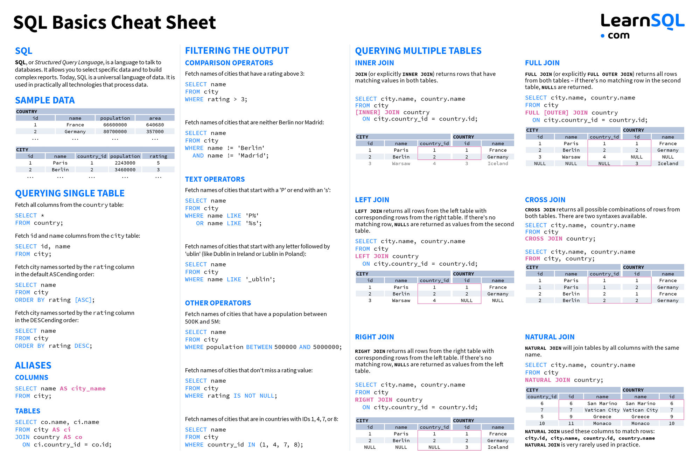
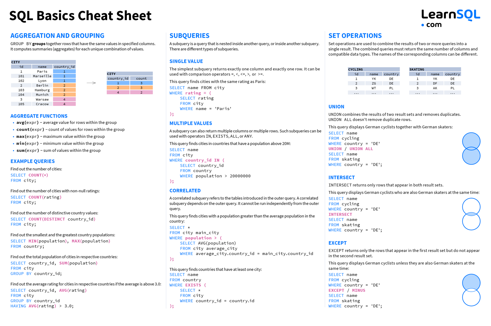

# Data Dive: immerse yourself in SQL and databases

An interactive workshop to introduce the fundamentals of SQL and databases.

## Requirements

You just need to have a computer with a Linux distribution installed. There is a list of recommended distributions below:

- [Ubuntu (version >= 18.04)](https://ubuntu.com/download/desktop)
- [Debian (version >= 10)](https://www.debian.org/distrib/)
- [Fedora (version >= 30)](https://getfedora.org/en/workstation/download/)

## Resources

- [Installation of MySQL Server on Linux](mysql-install.md)

## Cheat Sheets

#### Basics Cheatsheet

#### Advanced Cheatsheet
