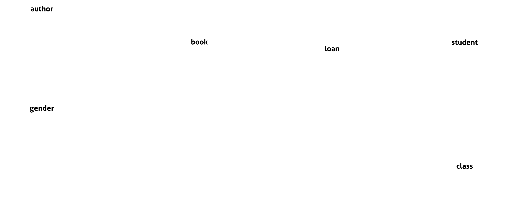

# Relationships between tables

## Table of Contents

1. [Database UML](#database-uml)
2. [Creating a Table with Foreign Key](#creating-a-table-with-foreign-key)
3. [Inserting Data](#inserting-data)
4. [Exercises](#exercises)

---

## Database UML



---

## Creating a Table with Foreign Key

### Step 1: Basic Table Creation

```sql
CREATE TABLE class (
    id INT PRIMARY KEY AUTO_INCREMENT,
    name VARCHAR(50)
);
```

### Step 2: Foreign Key Constraint

```sql
CREATE TABLE student (
    id INT PRIMARY KEY AUTO_INCREMENT,
    first_name VARCHAR(50),
    last_name VARCHAR(50),
    email VARCHAR(50),
    class_id INT,
    CONSTRAINT fk_class_id FOREIGN KEY (class_id) REFERENCES class(id)
);
```

Now you can create all the other tables in the database.

---

## Inserting Data

You can find the SQL script to insert all the data [here](data.sql).

---

## Exercises

### Exercise: Display All Students

Write an SQL query to display all the students in the database. The output should include the columns `id`, `first_name`, `last_name`, and `email`.

**Expected Result:**

```
| id | first_name | last_name | email                    |
|----|------------|-----------|--------------------------|
| 1  | John       | Doe       | john.doe@gmail.com       |
| 2  | Jane       | Doe       | jane.doe@gmail.com       |
| 3  | John       | Smith     | john.smith@gmail.com     |
| 4  | David      | Williams  | david.williams@gmail.com |
| 5  | Maria      | Garcia    | maria.garcia@gmail.com   |
| 6  | Mary       | Davis     | mary.davis@gmail.com     |
| 7  | James      | Brown     | james@brown@gmail.com    |
| 8  | Robert     | Miller    | robert.miller@gmail.com  |
```

### Exercise: Price of Books

Write an SQL query to display all books priced over `9.00`. The output should include the columns `id`, `name`, `author_id`, `gender_id`, and `price`.

**Expected Result:**

```
| id | name                  | author_id | gender_id | price |
|----|-----------------------|-----------|-----------|-------|
| 1  | Les Misérables        | 2         | 2         | 10.99 |
| 2  | Notre-Dame de Paris   | 2         | 2         | 9.99  |
```

### Exercise: Sort Authors by Age

Write an SQL query to retrieve a list of authors from the 'author' table, sorted by their age in ascending order. The output should include the columns `id`, `first_name`, `last_name`, and `age`.

**Expected Result:**

```
| id | first_name    | last_name      | age |
|----|---------------|----------------|-----|
| 6  | Arthur        | Rimbaud        | 37  |
| 3  | Charles       | Baudelaire     | 46  |
| 5  | Paul          | Verlaine       | 51  |
| 1  | Jean-Baptiste | Poquelin       | 51  |
| 4  | Jean          | de La Fontaine | 73  |
| 2  | Victor        | Hugo           | 83  |
```

---

### Exercise: Display Books Borrowed by John Doe

Write an SQL query to retrieve a list of books borrowed by `John Doe` from the **student** table. The output should include the columns `book_id` and `name` from the **book** table.

**Expected Result:**

```
| book_id | name                 |
|---------|----------------------|
| 1       | Les Misérables       |
| 4       | Le Spleen de Paris   |
```

### Exercise: Display Books with the Genre 'Theatre'

Write an SQL query to retrieve a list of books with the genre `Theatre` from the **book** table. The output should include the columns `id` and `name`.

**Expected Result:**

```
| id | name                     |
|----|--------------------------|
| 5  | Le Bourgeois gentilhomme |
| 6  | Les Fourberies de Scapin |
```

### Exercise: Display Students for Borrowing Before Date

Write an SQL query to retrieve students who borrowed a book before January 1, 2022. The output should include the columns `id`, `first_name`, `last_name`, and `email` from the 'student' table.

**Expected Result:**

```
| id | first_name | last_name | email                  |
|----|------------|-----------|------------------------|
| 7  | James      | Brown     | james@brown@gmail.com  |
| 5  | Maria      | Garcia    | maria.garcia@gmail.com |
```

---

Well done! 👏 You've completed the workshop! 🎉

---

## Resources

- <a href="https://www.w3schools.com/sql/sql_foreignkey.asp" target="_blank">SQL Foreign Key</a>
- <a href="https://www.w3schools.com/sql/sql_join.asp" target="_blank">SQL Join</a>